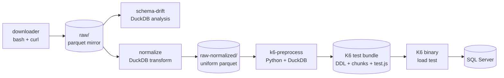

# Architecture

The taxi repo is a monorepo of four small tools plus a shared library. Together they form a pipeline — **download → analyze → normalize → load** — that turns the NYC TLC's public trip parquet files into something you can load-test a SQL Server target with. Individually, each tool is usable on its own: the downloader is a resumable HTTP mirror, schema-drift is a generic parquet-family analyzer, normalize rewrites parquet against a target schema, and k6-loadtest drives a customized K6 binary at a SQL Server.

The tools share conventions rather than code paths: parquet everywhere, DuckDB for introspection, explicit per-file atomicity for writes, and a human-in-the-loop policy for any decision that could silently lose data. The rest of this page walks through the repo layout, the pipeline DAG, and the design principles that recur across the tools. If you're new to the project, the pipeline DAG below is the fastest way to orient — everything else is elaboration on how each stage behaves and why it was built the way it was.

At a glance:

| Tool | Language | Input | Output |
| --- | --- | --- | --- |
| downloader | bash + curl | TLC CloudFront URLs | `raw/<type>/*.parquet` |
| schema-drift | Python + DuckDB | `raw/<type>/*.parquet` | drift report (stdout / file) |
| normalize | Python + DuckDB | `raw/<type>/*.parquet` + mapping YAML | `raw-normalized/<type>/*.parquet` |
| k6-loadtest | Python + DuckDB + Go/xk6 | `raw-normalized/<type>/*.parquet` (or synthetic) | K6 test bundle, then SQL Server load |

## Repo layout

```
taxi/
├── downloader/                       bash script + curl
├── schema-drift/
│   └── src/schema_drift/              analyzer (Python)
├── normalize/
│   ├── mappings/                      curated per-type YAML mappings
│   └── src/taxi_normalize/            normalizer (Python)
├── k6-loadtest/
│   ├── build_k6.sh                    Go/xk6 custom binary build
│   ├── config.sample.yaml
│   └── src/k6_loadtest/               Python preprocessor
├── shared/
│   └── src/taxi_shared/               shared library
├── tests/                             pytest per component
│   ├── k6_loadtest/
│   ├── schema_drift/
│   ├── taxi_normalize/
│   └── taxi_shared/
├── docs/                              this site
│   ├── guides/  cookbook.md  architecture.md  reference/  contributing.md
│   └── superpowers/                   design specs + implementation plans
├── mkdocs.yml
├── pyproject.toml                     single Python workspace, all packages
├── uv.lock
└── raw/                               gitignored — parquet mirror (per user)
```

A few things worth calling out:

- **Single `pyproject.toml`** at the root manages all four Python packages via `[tool.hatch.build.targets.wheel] packages = [...]`. There's one lockfile, one dependency graph, and one `uv sync` to get a working dev environment.
- **`src/` layout** used consistently — each Python package lives in `<component>/src/<package_name>/`. This enforces the "package under test is the installed package" rule: tests can't accidentally import the working-copy source and shadow the installed version.
- **Tests** live in `tests/<package_name>/` rather than `<component>/tests/`. That way pytest discovers them with default settings and there's no ambiguity about which fixtures apply to which package.
- **`docs/superpowers/`** contains design specs and implementation plans authored during development. They're kept publicly visible because they answer "why is X this way" better than after-the-fact prose can.
- **`raw/`** and `raw-normalized/` are `.gitignore`d. Every user maintains their own local mirror — the repo carries the code, not the data. On a fresh clone, the pipeline builds those directories the first time it's run.
- **`normalize/mappings/`** ships with curated YAML for each TLC data type. Those files *are* checked in — they're the human-reviewed record of every acknowledged drift decision, and they're what makes a fresh clone of the repo able to normalize the full historical dataset without re-doing the review work.

## The four-tool DAG



**Pipeline.** The typical flow is left-to-right:

1. The **downloader** mirrors CloudFront into `raw/` — a resumable, WAF-aware bash + curl script.
2. **schema-drift** reads the mirror and reports what's changed schema-wise across the years of parquet files. It doesn't rewrite anything; it just produces a report.
3. **normalize** rewrites historical files to match the latest schema, producing `raw-normalized/` — a directory of parquet with uniform columns and types across every month.
4. **k6-preprocess** turns normalized parquet into a K6 test bundle: DDL, per-run chunks, and a generated `test.js`.
5. **K6** (the custom xk6-sql build) executes the bundle against a SQL Server target.

See spec: docs/superpowers/specs/2026-03-25-k6-sql-load-testing-design.md for the k6-loadtest stage's design decisions (custom xk6 build, chunked test bundle format, synthetic mode).

Each stage writes its output to disk; the next stage reads from disk. There is no in-memory pipeline, no shared process, and no coordinator. That makes each stage individually restartable and individually inspectable — you can open the intermediate parquet in DuckDB, in Python, in DBeaver, or in any other tool that reads parquet, without any project-specific tooling.

**Independence.** No tool requires any of the others upstream:

- Use only the **downloader** if all you need is a resumable local mirror of TLC data.
- Use only **schema-drift** against any parquet family that follows a `_YYYY-MM.parquet` naming convention — the tool doesn't know or care that the files came from TLC.
- Use only **normalize** if you have parquet from somewhere else and want to consolidate it to a target schema. The mapping YAML format is generic.
- Use only **k6-preprocess** (with synthetic mode) if you don't have parquet at all and just want to load-test SQL Server against a plausible taxi-shaped schema.

The pipeline shape is a strong suggestion, not a contract. Anywhere you want to plug in your own tool between two stages, the seam is a directory of parquet files.

**Shared conventions across all stages.** Beyond the language-and-tool split, every stage follows the same handful of rules:

- Parquet is the interchange format. CSV, JSON, and native SQL Server tables show up only at the ends of the pipeline.
- DuckDB is the introspection engine. Every stage that needs to understand the shape of a parquet file reads its footer through DuckDB rather than hand-rolling parquet parsing.
- File naming follows `<type>_YYYY-MM.parquet`. schema-drift and normalize both assume this convention when grouping files into a "family" and ordering them chronologically.
- Configuration is YAML for anything a human edits (mapping files, k6-loadtest config) and command-line flags for anything an operator sets per-run. There are no `.env` files or hidden state directories.

## Core design principles

### WAF-aware retry

The downloader treats CloudFront's 403 responses as a first-class classification problem. Blocked traffic (WAF) and missing files (S3 `AccessDenied`) both come back as HTTP 403; only the response body distinguishes them. Naive clients can't tell them apart and either false-positive on rate limiting (unnecessary backoff on files that just don't exist) or hammer through a WAF block, extending the ban.

The downloader's classifier looks at the body, then applies an exponential backoff ladder (5 → 15 → 60 minutes) when it sees a real WAF signal, and terminates cleanly at the year/month boundary when it has exhausted retries. A `404`-equivalent (S3 saying "this month wasn't published") is recorded and skipped without triggering backoff. That combination lets unattended catch-up runs stay well-behaved without a human sitting on them, and it lets the same script be invoked from cron without risking a runaway retry loop against a live WAF policy.

### Data loss is an error

The normalizer refuses to silently drop columns or perform lossy casts. Every discarded column, every type-narrowing cast, every null-fill of a previously-required column requires an explicit `ack_date` in the mapping YAML acknowledging the decision. The rationale: normalization is lossy by definition (target schema ≠ source schema), and treating that as "just log a warning and move on" is exactly how production surprises happen years later.

Making it a hard error forces the human to think about the trade-off once, then documents the decision in git history where the next person can find it. When a new drift shows up in a subsequent month, the normalizer's bootstrap+amend workflow produces a *commented* YAML entry for the new item — the pipeline breaks until a human uncomments it, and the reviewer can see exactly which month first introduced the change. Silent success is never a state the tool can end up in.

See spec: docs/superpowers/specs/2026-07-21-normalizer-design.md.

The bootstrap+amend workflow referenced above is worth a brief note because several other sections rely on it.

**Bootstrap** is the initial mapping YAML generated from a full analysis of the historical parquet. It records the target schema, the acknowledged drops and casts, and the accepted renames.

**Amend** is the mode the normalizer runs in on subsequent passes: it compares current files against the existing mapping and adds commented entries for anything new (new columns, new type variations, new candidate renames). The reviewer then decides which of those entries to uncomment. This gives new drift the same review discipline as the original mapping without re-doing the whole review each month.

### Per-file atomicity

Both the normalizer and the downloader write to `<name>.tmp.<ext>` and atomically rename to the final path via `os.replace` / `mv` only after the write succeeds. Interrupted runs leave no half-written files. When either tool checks whether an existing file is "already done", it validates the PAR1 head-and-tail bytes rather than just checking that the path exists — a zero-byte or truncated file will not pass the check and will be re-downloaded or re-normalized on the next run.

The combination survives Ctrl-C, network drops, and disk-full events without state corruption. There are no lock files, no journal, no separate manifest to keep in sync — the filesystem itself is the state store. This matters most for long-running downloader jobs, where a mid-file crash is inevitable at some point over 15 years of data, and for normalize runs against thousands of parquet files, where any per-file bookkeeping would become its own reliability problem.

### Metadata-first, scan only when needed

Parquet footers store per-column min, max, null-count, and type. The normalizer's planner uses those to decide auto-drop safety (is the column all-null?), auto-cast safety (does the observed range fit the target type?), and null-fill decisions (is the column missing entirely from this file?) — no data scan required. A directory of a hundred parquet files can be planned in a few hundred milliseconds because it's just a hundred footer reads.

Only precision-loss checks — for example, `DOUBLE` → `BIGINT` when the source has fractional values — require a full column scan. Those always run at 100% sample regardless of the `--sample` flag, because "we sampled and didn't see a problem" is not a safe answer to that particular question: a single fractional row would silently truncate. Metadata reads are constant-time per file; scans are linear in row count, and the difference matters when you're normalizing 15 years of monthly parquet.

### Human-in-the-loop for ambiguity

schema-drift's rename detection is heuristic. It compares column names and value distributions across months and decides whether a "dropped" column and an "added" column in the same file are actually the same column with a new name.

High-confidence renames get marked as such; low-confidence ones get emitted as `SUGGESTED` with a confidence percentage rather than acted on. normalize's bootstrap+amend workflow takes those `SUGGESTED` items and turns them into **commented** YAML that a human uncomments to accept. No matter how good the heuristic gets, this pattern keeps the human in control of the decisions that matter — column renames across years of production data are not a place for silent auto-remediation, and confidence percentages give the reviewer a first-pass filter without pretending to make the decision for them.

### Monorepo rationale

Four separate repos would have been the default choice. This project runs as a monorepo because:

- The four tools share a common data domain (TLC parquet, DuckDB introspection, SQL Server type mapping). Splitting them would fragment domain knowledge across four `README.md` files.
- `taxi_shared` (DuckDB → SQL Server type mapping + CREATE TABLE generation) is used by k6-loadtest today and will be used by the planned SQL Server loader tomorrow. Splitting would require versioning, publishing, and coordinating three separate repos to make a change that today is a single PR.
- One `pyproject.toml`, one `uv.lock`, one test suite, one `mkdocs build`. Ops is dramatically simpler.
- Each tool remains independently usable — the monorepo structure documents the coupling that exists (shared library, shared conventions) without forcing coupling that doesn't (each tool has its own CLI entry point and its own directory).

See spec: docs/superpowers/specs/2026-07-19-monorepo-restructure-design.md.

The design spec above documents the pre-monorepo layout (three separate repos) and the transition; if you're wondering why a particular directory or import path looks the way it does, that's the first place to check.

## The `taxi_shared` package

`shared/src/taxi_shared/` is deliberately small. Two modules:

- **`type_mapping.py`** — DuckDB → SQL Server type mapping. Handles the common cases (`DOUBLE` → `FLOAT`, `VARCHAR` → `NVARCHAR(MAX)`, `TIMESTAMP` → `DATETIME2`, and so on) and the `DECIMAL(p,s)` parameterization where DuckDB's precision and scale are carried through to the SQL Server column definition.
- **`sql_generator.py`** — `CREATE TABLE` DDL generation from a DuckDB schema. Used by k6-loadtest's preprocessor today, and reserved for use by the future SQL Server loader.

The downloader, schema-drift, and normalize don't import `taxi_shared` — none of them touch SQL Server. Keeping the shared library scoped to the SQL Server concern keeps its API surface small and its change cadence slow: type mappings change when SQL Server introduces a new type, which is roughly once a decade.

The alternative — a fat "utilities" package that everything imports — would tie the four tools' release cadences together and turn every shared-library refactor into a coordinated change across the whole repo. The current shape means `taxi_shared` can be evolved for SQL Server needs without any risk of breaking the downloader.

If shared logic is discovered later (for example, a parquet-family iteration helper used by both schema-drift and normalize), the plan is to add a second small package under `shared/src/` rather than growing `taxi_shared` into a catch-all.

## Testing philosophy

Every test builds its own synthetic parquet fixtures with DuckDB inside `conftest.py` (per component) and writes them under `tmp_path`. There are no network dependencies, no shared filesystem state, and no fixtures that persist across runs. This means:

- **Fast**: 83 tests run in under a second.
- **Deterministic**: no flakiness from external services, no rate-limited APIs, no "the CI runner had a different DNS resolver" mysteries.
- **Isolated**: tests can't corrupt each other's state because each one writes to its own `tmp_path`.
- **Grounded**: fixtures produce real parquet files that exercise the real DuckDB code paths. There are no mocks of DuckDB or of the parquet reader — the code that runs in tests is the code that runs in production.
- **Debuggable**: when a test fails, `tmp_path` contains the actual parquet files that broke it. You can open them in DuckDB and inspect them directly, without regenerating anything.

The downside is real: there is no true end-to-end test against live TLC CloudFront, a real SQL Server, or a real xk6-sql runner. Those integration points are validated manually before releases. That trade-off is acceptable for a project of this size; a larger codebase would need a separate integration suite that runs less often but exercises the real dependencies.

The upshot is that the test suite doubles as a fast feedback loop during development. `pytest` on a laptop is under a second, so a change-run-observe cycle costs less than a git commit. That's a deliberate design goal, not an accident of scale.

Component-level test layouts:

- `tests/schema_drift/` — synthetic parquet families with injected column adds, drops, renames, and type changes.
- `tests/taxi_normalize/` — synthetic parquet with schema drift plus mapping YAML fixtures covering acknowledged and unacknowledged drift.
- `tests/k6_loadtest/` — synthetic parquet used to drive the preprocessor; the K6 binary itself is not exercised in unit tests.
- `tests/taxi_shared/` — DuckDB schemas fed through the type mapper and DDL generator; string-compare against expected `CREATE TABLE` output.

## What's not built yet

A few sub-projects are planned but not implemented. They're mentioned here because the current architecture leaves seams for them — each is a stage or wrapper that fits into the existing pipeline without changing the shape of what's already built.

- **SQL Server loader** — a DuckDB-based bulk loader that consumes `raw-normalized/<type>/**/*.parquet` and populates a SQL Server database. Today the load step happens indirectly, as a side effect of running k6-loadtest, which is fine for load testing but awkward for actually populating a warehouse. A dedicated loader would decouple "load the data" from "load-test SQL Server" and reuse `taxi_shared` for DDL generation.
- **Orchestrator** — a scheduler + state tracker that runs the full pipeline (download → analyze → normalize → load) on a cadence, tracks last-successful-run per data type, and notifies a human when normalize amends a mapping (i.e., new drift needs review). This is the operational counterpart of the bootstrap+amend design: today the human runs each step; the orchestrator would run the steps and pull the human in only when normalize flags something as needing acknowledgement.
- **CI testing pipeline + dev/test/prod promotion** — a CI workflow already runs on push (`.github/workflows/ci.yml`) and executes the pytest suite. Staged promotion of loaded data across dev, test, and prod SQL Server instances — with schema-diff gates between environments — is future work and depends on the SQL Server loader landing first.

None of these are blocking for the current use cases (mirror TLC data, analyze drift, normalize to a target schema, load-test SQL Server). They're listed so the architecture's future shape is legible from today's code.
