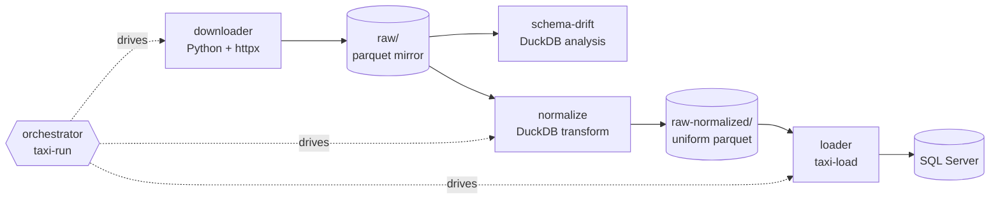

# Architecture

The taxi-seed repo is a monorepo of five small tools plus a shared library. Together they form a pipeline — **download → normalize → load** — that turns the NYC TLC's public trip parquet files into rows in a SQL Server database. Individually, each tool is usable on its own: the downloader is a resumable HTTP mirror, schema-drift is a generic parquet-family analyzer, normalize rewrites parquet against a target schema, the loader bulk-loads normalized parquet into SQL Server via DuckDB, and the orchestrator chains the other stages together as one command.

The tools share conventions rather than code paths: parquet everywhere, DuckDB for introspection, explicit per-file atomicity for writes, and a human-in-the-loop policy for any decision that could silently lose data. The rest of this page walks through the repo layout, the pipeline DAG, and the design principles that recur across the tools. If you're new to the project, the pipeline DAG below is the fastest way to orient — everything else is elaboration on how each stage behaves and why it was built the way it was.

At a glance:

| Tool | Language | Input | Output |
| --- | --- | --- | --- |
| downloader | Python + httpx | TLC CloudFront URLs | `raw/<type>/*.parquet` |
| schema-drift | Python + DuckDB | `raw/<type>/*.parquet` | drift report (stdout / file) |
| normalize | Python + DuckDB | `raw/<type>/*.parquet` + mapping YAML | `raw-normalized/<type>/*.parquet` |
| loader | Python + DuckDB (`mssql` extension) | `raw-normalized/<type>/*.parquet` | SQL Server tables (one per type per year) |
| orchestrator | Python | none directly — drives the other stages as subprocesses | chained download → normalize → load run + summary |

## Repo layout

```
taxi-seed/
├── downloader/
│   └── src/taxi_download/             resumable mirror (Python + httpx)
├── schema-drift/
│   └── src/schema_drift/              analyzer (Python)
├── normalize/
│   ├── mappings/                      curated per-type YAML mappings
│   └── src/taxi_normalize/            normalizer (Python)
├── loader/
│   └── src/taxi_loader/               bulk loader (Python + DuckDB `mssql` extension)
├── orchestrator/
│   └── src/taxi_orchestrate/          taxi-run + taxi-curate-mappings (curate.py)
├── shared/
│   └── src/taxi_shared/               shared library
├── scripts/                           CI/dev helpers (wait_for_mssql.py, e2e-smoke.sh)
├── tests/                             pytest per component
│   ├── downloader/
│   ├── schema_drift/
│   ├── taxi_normalize/
│   ├── taxi_loader/
│   ├── taxi_orchestrate/
│   ├── taxi_shared/
│   └── e2e/
├── docs/                              this site
│   ├── guides/  cookbook.md  architecture.md  reference/  contributing.md
│   └── superpowers/                   design specs + implementation plans
├── mkdocs.yml
├── pyproject.toml                     single Python workspace, all six packages
├── uv.lock
└── raw/                               gitignored — parquet mirror (per user)
```

A few things worth calling out:

- **Single `pyproject.toml`** at the root manages all six Python packages (`taxi_download`, `schema_drift`, `taxi_normalize`, `taxi_loader`, `taxi_orchestrate`, `taxi_shared`) via `[tool.hatch.build.targets.wheel] packages = [...]`. There's one lockfile, one dependency graph, and one `uv sync` to get a working dev environment.
- **`src/` layout** used consistently — each Python package lives in `<component>/src/<package_name>/`. This enforces the "package under test is the installed package" rule: tests can't accidentally import the working-copy source and shadow the installed version.
- **Tests** live in `tests/<package_name>/` rather than `<component>/tests/`. That way pytest discovers them with default settings and there's no ambiguity about which fixtures apply to which package.
- **`docs/superpowers/`** contains design specs and implementation plans authored during development. They're kept publicly visible because they answer "why is X this way" better than after-the-fact prose can.
- **`raw/`** and `raw-normalized/` are `.gitignore`d. Every user maintains their own local mirror — the repo carries the code, not the data. On a fresh clone, the pipeline builds those directories the first time it's run.
- **`normalize/mappings/`** ships with curated YAML for each TLC trip type. Those files *are* checked in — they're the human-reviewed record of every acknowledged drift decision, and they're what makes a fresh clone of the repo able to normalize the full historical dataset without re-doing the review work.

## The pipeline DAG



**Pipeline.** The typical flow is left-to-right:

1. The **downloader** (`taxi-download`) mirrors CloudFront into `raw/` — a resumable, WAF-aware Python client built on `httpx`.
2. **schema-drift** reads the mirror and reports what's changed schema-wise across the years of parquet files. It doesn't rewrite anything; it just produces a report.
3. **normalize** rewrites historical files to match the latest schema, producing `raw-normalized/` — a directory of parquet with uniform columns and types across every month.
4. The **loader** (`taxi-load`) bulk-loads normalized parquet into SQL Server, one table per type per year, through DuckDB's `mssql` community extension. It reconciles disk against what's already loaded and picks, per year, skip / append / truncate-reload — see the [loader guide](guides/loader.md) for the full reconciliation model.
5. The **orchestrator** (`taxi-run`) isn't a pipeline stage itself — it drives stages 1, 3, and 4 as subprocesses for one command, per trip type, stopping a type early if a stage needs human review or fails outright. See the [orchestrator guide](guides/orchestrator.md).

Each stage writes its output to disk; the next stage reads from disk. There is no in-memory pipeline, no shared process between the four data stages, and no coordinator baked into any one of them — `taxi-run` is an optional layer on top, not a requirement. That makes each stage individually restartable and individually inspectable — you can open the intermediate parquet in DuckDB, in Python, in DBeaver, or in any other tool that reads parquet, without any project-specific tooling.

**Independence.** No tool requires any of the others upstream:

- Use only the **downloader** if all you need is a resumable local mirror of TLC data.
- Use only **schema-drift** against any parquet family that follows a `_tripdata_YYYY-MM.parquet` naming convention — the tool doesn't know or care that the files came from TLC.
- Use only **normalize** if you have parquet from somewhere else and want to consolidate it to a target schema. The mapping YAML format is generic.
- Use only the **loader** if you already have normalized parquet from somewhere else and just want it in SQL Server — it doesn't know or care how `raw-normalized/` was produced.

The pipeline shape is a strong suggestion, not a contract. `taxi-run` exists for the common case (run everything, in order, unattended), but nothing stops you from wiring your own tool into the seam between two stages — the seam is always a directory of parquet files.

**Shared conventions across all stages.** Beyond the language-and-tool split, every stage follows the same handful of rules:

- Parquet is the interchange format. CSV, JSON, and native SQL Server tables show up only at the ends of the pipeline.
- DuckDB is the introspection engine. Every stage that needs to understand the shape of a parquet file reads its footer through DuckDB rather than hand-rolling parquet parsing.
- File naming follows `<type>_tripdata_YYYY-MM.parquet`. schema-drift and normalize both assume this convention when grouping files into a "family" and ordering them chronologically.
- Configuration is YAML for anything a human edits (mapping files) and command-line flags for anything an operator sets per-run. There are no `.env` files or hidden state directories; the loader's password is the one deliberate exception, and it comes only from the `MSSQL_PASSWORD` environment variable, never a flag.

## Core design principles

### WAF-aware retry

The downloader treats CloudFront's 403 responses as a first-class classification problem. Blocked traffic (WAF) and missing files (S3 `AccessDenied`) both come back as HTTP 403; only the response body distinguishes them. Naive clients can't tell them apart and either false-positive on rate limiting (unnecessary backoff on files that just don't exist) or hammer through a WAF block, extending the ban.

The downloader's classifier looks at the body. On a real WAF signal it makes four attempts, waiting 30s, then 90s, then 270s between them, and terminates cleanly at the year/month boundary once those are exhausted. A `404`-equivalent (S3 saying "this month wasn't published") is recorded and skipped without triggering backoff. That combination lets unattended catch-up runs stay well-behaved without a human sitting on them, and it lets the same tool be invoked from cron without risking a runaway retry loop against a live WAF policy.

### Data loss is an error

The normalizer refuses to silently drop columns or perform lossy casts. Every discarded column, every type-narrowing cast, every null-fill of a previously-required column requires an explicit `ack_date` in the mapping YAML acknowledging the decision. The rationale: normalization is lossy by definition (target schema ≠ source schema), and treating that as "just log a warning and move on" is exactly how production surprises happen years later.

Making it a hard error forces the human to think about the trade-off once, then documents the decision in git history where the next person can find it. When a new drift shows up in a subsequent month, the normalizer's bootstrap+amend workflow produces a *commented* YAML entry for the new item — the pipeline breaks until a human uncomments it, and the reviewer can see exactly which month first introduced the change. Silent success is never a state the tool can end up in.

See spec: docs/superpowers/specs/2026-07-21-normalizer-design.md.

The bootstrap+amend workflow referenced above is worth a brief note because several other sections rely on it.

**Bootstrap** is the initial mapping YAML generated from a full analysis of the historical parquet. It records the target schema, the acknowledged drops and casts, and the accepted renames.

**Amend** is the mode the normalizer runs in on subsequent passes: it compares current files against the existing mapping and adds commented entries for anything new (new columns, new type variations, new candidate renames). The reviewer then decides which of those entries to uncomment. This gives new drift the same review discipline as the original mapping without re-doing the whole review each month.

### Per-file atomicity

Both the normalizer and the downloader write to a temp path and atomically rename to the final path via `os.replace` only after the write succeeds. Interrupted runs leave no half-written files. When either tool checks whether an existing file is "already done" and can be skipped, that check is a plain presence check (`dest.exists()` for the downloader, `out_path.exists()` for the normalizer) — but every freshly downloaded file *is* validated against the PAR1 parquet magic bytes before being accepted, so a zero-byte or truncated download is caught and re-fetched rather than silently left on disk to be skipped later.

The combination survives Ctrl-C, network drops, and disk-full events without state corruption. There are no lock files, no journal, no separate manifest to keep in sync for these two stages — the filesystem itself is the state store. This matters most for long-running downloader jobs, where a mid-file crash is inevitable at some point over 15 years of data, and for normalize runs against thousands of parquet files, where any per-file bookkeeping would become its own reliability problem. (The loader is the one stage that *does* keep a manifest — see the [loader guide](guides/loader.md#idempotent-reconcile-skip-append-truncate-reload) — because "already loaded into SQL Server" isn't something a filesystem check alone can answer.)

### Metadata-first, scan only when needed

Parquet footers store per-column min, max, null-count, and type. The normalizer's planner uses those to decide auto-drop safety (is the column all-null?), auto-cast safety (does the observed range fit the target type?), and null-fill decisions (is the column missing entirely from this file?) — no data scan required. A directory of a hundred parquet files can be planned in a few hundred milliseconds because it's just a hundred footer reads.

Only precision-loss checks — for example, `DOUBLE` → `BIGINT` when the source has fractional values — require a full column scan. Those always run at 100% sample regardless of the `--sample` flag, because "we sampled and didn't see a problem" is not a safe answer to that particular question: a single fractional row would silently truncate. Metadata reads are constant-time per file; scans are linear in row count, and the difference matters when you're normalizing 15 years of monthly parquet.

### Human-in-the-loop for ambiguity

schema-drift's rename detection is heuristic. It compares column names and value distributions across months and decides whether a "dropped" column and an "added" column in the same file are actually the same column with a new name.

High-confidence renames get marked as such; low-confidence ones get emitted as `SUGGESTED` with a confidence percentage rather than acted on. normalize's bootstrap+amend workflow takes those `SUGGESTED` items and turns them into **commented** YAML that a human uncomments to accept. No matter how good the heuristic gets, this pattern keeps the human in control of the decisions that matter — column renames across years of production data are not a place for silent auto-remediation, and confidence percentages give the reviewer a first-pass filter without pretending to make the decision for them. (`taxi-curate-mappings` offers an explicitly-invoked, opt-in way to auto-accept this class of decision when unattended operation matters more than a per-drift human review — see the [orchestrator guide](guides/orchestrator.md#taxi-curate-mappings).)

### Monorepo rationale

Five separate repos would have been the default choice. This project runs as a monorepo because:

- The tools share a common data domain (TLC parquet, DuckDB introspection, SQL Server type mapping). Splitting them would fragment domain knowledge across five separate `README.md` files.
- `taxi_shared` (DuckDB → SQL Server type mapping + CREATE TABLE generation) is used by the loader today. Splitting the loader and `taxi_shared` into separate repos would require versioning, publishing, and coordinating two repos to make a change that today is a single PR.
- One `pyproject.toml`, one `uv.lock`, one test suite, one `mkdocs build`. Ops is dramatically simpler.
- Each tool remains independently usable — the monorepo structure documents the coupling that exists (shared library, shared conventions) without forcing coupling that doesn't (each tool has its own CLI entry point and its own directory).

See spec: docs/superpowers/specs/2026-07-19-monorepo-restructure-design.md.

The design spec above documents the pre-monorepo layout (three separate repos) and the transition; if you're wondering why a particular directory or import path looks the way it does, that's the first place to check.

## The `taxi_shared` package

`shared/src/taxi_shared/` is deliberately small. Two modules:

- **`type_mapping.py`** — DuckDB → SQL Server type mapping. Handles the common cases (`DOUBLE` → `FLOAT`, `VARCHAR` → `NVARCHAR(MAX)`, `TIMESTAMP` → `DATETIME2`, and so on) and the `DECIMAL(p,s)` parameterization where DuckDB's precision and scale are carried through to the SQL Server column definition.
- **`sql_generator.py`** — `CREATE TABLE` DDL generation from a DuckDB schema. Used by the loader (`taxi_loader`) to derive each year's table DDL directly from the normalized parquet's schema. Generated tables are page-compressed (`WITH (DATA_COMPRESSION = PAGE)`), unconditionally — see the [Loader guide](guides/loader.md#page-compression).

The downloader, schema-drift, and normalize don't import `taxi_shared` — none of them touch SQL Server. Keeping the shared library scoped to the SQL Server concern keeps its API surface small and its change cadence slow: type mappings change when SQL Server introduces a new type, which is roughly once a decade.

The alternative — a fat "utilities" package that everything imports — would tie every tool's release cadence together and turn every shared-library refactor into a coordinated change across the whole repo. The current shape means `taxi_shared` can be evolved for SQL Server needs without any risk of breaking the downloader.

If shared logic is discovered later (for example, a parquet-family iteration helper used by both schema-drift and normalize), the plan is to add a second small package under `shared/src/` rather than growing `taxi_shared` into a catch-all.

## Testing philosophy

Every test builds its own synthetic parquet fixtures with DuckDB inside `conftest.py` (per component) and writes them under `tmp_path`. There are no network dependencies, no shared filesystem state, and no fixtures that persist across runs. This means:

- **Fast**: the fast unit suite — every test except `tests/taxi_loader/test_load_integration.py` and `tests/e2e/` — runs in seconds on a laptop, no external services required. This is what `uv run --extra test pytest -q` gives you locally and what CI's `test` job runs on every push.
- **Deterministic**: no flakiness from external services, no rate-limited APIs, no "the CI runner had a different DNS resolver" mysteries.
- **Isolated**: tests can't corrupt each other's state because each one writes to its own `tmp_path`.
- **Grounded**: fixtures produce real parquet files that exercise the real DuckDB code paths. There are no mocks of DuckDB or of the parquet reader — the code that runs in tests is the code that runs in production.
- **Debuggable**: when a test fails, `tmp_path` contains the actual parquet files that broke it. You can open them in DuckDB and inspect them directly, without regenerating anything.

A second, smaller suite needs a real SQL Server: `tests/taxi_loader/test_load_integration.py` and `tests/e2e/test_pipeline_e2e.py` are skipped automatically unless `MSSQL_PASSWORD` is set. CI's `integration` job runs them against a disposable `mssql/server` container on every push; locally, `scripts/e2e-smoke.sh` does the same (bring up a container, `scripts/wait_for_mssql.py` to wait for readiness, run the two suites, tear the container down). There is still no test against live TLC CloudFront — that integration point is validated manually before releases — but the SQL Server side is exercised automatically now that the loader exists.

The upshot is that the fast unit suite doubles as a tight feedback loop during development — a change-run-observe cycle that costs less than a git commit — while the container-backed integration/e2e suite catches the class of bug (a `COPY` that doesn't actually round-trip through the `mssql` extension, a pipeline wiring mistake) that synthetic-fixture unit tests structurally can't.

Component-level test layouts:

- `tests/downloader/` — synthetic PAR1 fixtures and stubbed HTTP responses exercising the WAF classifier, backoff ladder, and recent-mode/full-history walkers.
- `tests/schema_drift/` — synthetic parquet families with injected column adds, drops, renames, and type changes.
- `tests/taxi_normalize/` — synthetic parquet with schema drift plus mapping YAML fixtures covering acknowledged and unacknowledged drift.
- `tests/taxi_loader/` — the reconcile planner (skip/append/reload) tested purely against synthetic disk/manifest/table-count inputs, plus `test_load_integration.py` for the real `COPY`-into-SQL-Server path (needs `MSSQL_PASSWORD`, skipped otherwise).
- `tests/taxi_orchestrate/` — stage classification (`pipeline.classify`, `overall_exit_code`) and CLI wiring, with the subprocess calls to the other tools stubbed out.
- `tests/taxi_shared/` — DuckDB schemas fed through the type mapper and DDL generator; string-compare against expected `CREATE TABLE` output.
- `tests/e2e/` — the full download → normalize → load pipeline run against generated fake data and a real SQL Server; skipped without `MSSQL_PASSWORD`.

## Build status

Every pipeline stage is built, and each has a guide linked from this page. The release
pipeline is in place too:

- `.github/workflows/release.yml` publishes on any `v*` tag — `vX.Y.Z` to PyPI, anything
  else to TestPyPI, both via Trusted Publishing. `v0.1.0` and `v0.2.0` are out.
- Work lands on `dev` through PRs and is promoted to `main` for a release. Both branches
  require the `integration` job as a status check, and both enforce it for admins too.

See the [Releasing runbook](operations/releasing.md) for the maintainer side, and
`docs/superpowers/specs/2026-07-25-devtestprod-promotion-design.md` for the design this
followed.
