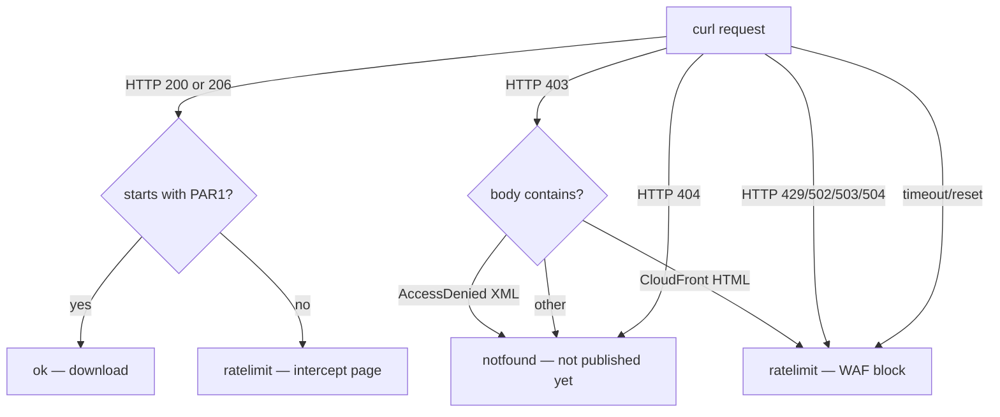

# Downloader

The downloader is a bash script that mirrors NYC TLC parquet trip data from CloudFront to a local `raw/` directory. It walks each series chronologically, skips files you already have, validates every download, and knows the difference between a rate-limit block and a file that hasn't been published yet.

It exists because of a specific ambiguity in TLC's CloudFront distribution: HTTP 403 is returned both for files that don't exist yet (with an S3-style `<Code>AccessDenied</Code>` XML body) *and* for requests blocked by AWS WAF, the Web Application Firewall that CloudFront runs in front of the origin (with CloudFront's "The request could not be satisfied" HTML page). Naive downloaders can't tell them apart, so they either false-positive on rate limiting (backing off unnecessarily on missing files) or false-negative on missing files (hammering a WAF block and extending it). This script classifies the responses correctly and reacts appropriately to each.

When *not* to use it: if you only need ad-hoc analytics and don't want the disk cost, DuckDB's `httpfs` extension querying CloudFront directly is often the right answer — see [Alternatives](#alternatives) below. The downloader is for cases where you want a resumable local mirror: bulk analytics that will re-read the same months many times, offline work, feeding a database via a nightly job, or scheduled catch-up as new months publish.

## Prerequisites

- **bash 4+** — check with `bash --version`
- **curl**

macOS and Linux ship both by default. On Windows, install [Git for Windows](https://gitforwindows.org/) and run the script in Git Bash.

Disk sized to your intent — see [Disk sizing](#disk-sizing) below.

## Disk sizing {#disk-sizing}

| Scope                       | Disk needed | Time (residential connection) |
|-----------------------------|-------------|-------------------------------|
| `--recent 3 yellow`         | ≈200 MB     | 1–2 min                       |
| `--recent 3 green`          | ≈15 MB      | seconds                       |
| `--recent 3 fhv`            | ≈120 MB     | 1 min                         |
| `--recent 3 fhvhv`          | ≈1.5 GB     | 5–10 min                      |
| `--recent 3` (all four)     | ≈1.8 GB     | 8–15 min                      |
| Full history yellow only    | ≈30 GB      | 2–4 hours                     |
| Full history green only     | ≈1.2 GB     | 5–10 min                      |
| Full history fhv only       | ≈6 GB       | 30–60 min                     |
| Full history fhvhv only     | ≈37 GB      | 2–4 hours                     |
| **Full history (all four)** | **≈75 GB**  | **6–10 hours**                |

TLC adds roughly 2 GB/month across all types (mostly FHVHV). Plan capacity accordingly if you're building a long-lived mirror.

## Install

None. It's a bash script — clone the repo and run it.

## Basic usage

```bash
# Full history, all four types (~75 GB, 6–10 hours)
./downloader/download_taxi_data.sh

# Full history, one type only
./downloader/download_taxi_data.sh yellow

# Recent N months (default 3), all types
./downloader/download_taxi_data.sh --recent

# Recent N months (default 3), one type only
./downloader/download_taxi_data.sh --recent yellow

# Recent 5 months of one type
./downloader/download_taxi_data.sh --recent 5 yellow
```

`TYPE` is one of: `yellow`, `green`, `fhv`, `fhvhv`.

The script is idempotent: files already present under the output directory are skipped, and any file that fails PAR1 validation is deleted at the start of the next run and re-downloaded. You can safely `Ctrl-C` mid-run and re-invoke with the same arguments — it will pick up where it left off without duplicating work.

## Windows / WSL {#windows-wsl}

**Git Bash (native Windows).** Install [Git for Windows](https://gitforwindows.org/), open Git Bash, `cd` to your clone, and run the script exactly as documented above. No extra config needed for small pulls.

**WSL2 — the VHDX growth problem.** WSL2 stores your Linux filesystem in a VHDX file on your Windows `C:` drive. Every byte written under the WSL2 root (including `~`, `/home`, `/tmp`, `/opt`) goes into this VHDX file. Full-history TLC data is 100+ GB. The catch: **the VHDX does not shrink when you delete files.** If you download 75 GB into WSL, then `rm -rf` it, your `C:` drive is still 75 GB smaller until you manually compact the VHDX with `wsl --shutdown` + `diskpart`, or `Optimize-VHD` in an elevated PowerShell.

**The fix: point downloads at a Windows path from inside WSL.** Anything under `/mnt/c/...` writes directly to the Windows filesystem, bypassing the VHDX entirely:

```bash
OUTPUT_DIR=/mnt/c/Users/$USER/taxi-data ./downloader/download_taxi_data.sh --recent 3 yellow
```

Deleting files there frees space immediately, and you can point Windows-side tools at the same directory without a WSL round-trip.

**The interactive prompt.** When the script detects it's running inside WSL and `OUTPUT_DIR` still resolves to the Linux filesystem, it prints a warning about VHDX growth and prompts `Continue? [y/N]`. In non-interactive contexts (cron, CI, `< /dev/null`) it proceeds without prompting — the warning is informational only.

## What makes it different

### WAF-aware classifier



The script probes each URL with a small ranged request; based on the status code and the first few bytes of the body, it decides whether to download the file, skip it as unpublished, or back off because a WAF rule fired.

Three response types get special handling:

- **`403` with `AccessDenied` XML** — the file legitimately isn't published yet. This is the boundary signal used by the full-history walker to stop cleanly at the end of a series.
- **`403` with CloudFront HTML** — the WAF has flagged your requests. Triggers the exponential backoff ladder.
- **`200` with a body that doesn't start with `PAR1`** — usually a WAF intercept page served with a 200 code. Treated as a rate-limit event, not a corrupt file, because retrying with a fresh connection often succeeds.

### Exponential backoff

Consecutive rate-limit events trigger a **5 → 15 → 60 minute** wait ladder. After the third escalation the script aborts with a non-zero exit code so cron jobs surface the problem instead of sleeping indefinitely.

The counter resets on any successful download. "Consecutive" means successive rate-limit events *without* an intervening success — a single successful file between two blocks resets you to backoff #1.

### Boundary auto-termination

In full-history mode the walker moves chronologically forward from a hardcoded start year per series (`yellow=2009`, `green=2013`, `fhv=2015`, `fhvhv=2019`). When it hits a `notfound` response *after* having already downloaded at least one file for that type, it treats that as the end of published data — the walker stops for that type and moves on to the next. That's why running `./download_taxi_data.sh` cleanly terminates instead of walking forever into the future.

### PAR1 magic-byte validation

Every downloaded file is verified as valid parquet by checking the `PAR1` magic bytes at **both** head and tail. This catches two failure modes at once:

- **Truncated downloads** — dropped connection mid-transfer, missing tail marker.
- **WAF-intercept HTML** that somehow landed at a `.parquet` path — HTML starts with `<`, not `PAR1`.

Any file failing this check is deleted at the start of the next run, so an interrupted download self-heals without manual cleanup.

## Recent-mode semantics

Walker rules, in order:

1. Start at the previous month (`current-1`). Walk backward one month at a time.
2. Remote file downloads successfully → increment the "kept" counter.
3. Remote returns "not published yet" (`403 + AccessDenied` XML) → skip, don't count, keep walking.
4. Local file already exists at that path → **STOP** walking. This is the incremental catch-up semantic.
5. Loop terminates when the counter hits `N`, OR the local-encounter break fires, OR `max_lookback_months` is reached (safety cap for genuinely-empty-series edge cases).

Three worked examples. Assume today is **2026-07-22** and yellow publishes with a ~2 month lag.

**Example 1: Fresh checkout, `--recent 3 yellow`.**

- Tries 2026-06 → `notfound` (not yet published)
- Tries 2026-05 → downloads
- Tries 2026-04 → downloads
- Tries 2026-03 → downloads

Result: 3 files, walked back 4 months.

**Example 2: Same setup a month later, `--recent 3 yellow`.**

- Tries 2026-07 → `notfound`
- Tries 2026-06 → downloads
- Tries 2026-05 → already local → **STOP**

Result: 1 new file. This is the intended incremental catch-up outcome — you get the new month and nothing else.

**Example 3: Already caught up, `--recent 3 yellow`.**

- Tries 2026-06 → `notfound`
- Tries 2026-05 → already local → **STOP**

Result: 0 new files, exits cleanly.

If you delete a local file mid-history, subsequent `--recent` runs won't backfill it — they stop at the newer files above. Use `./download_taxi_data.sh yellow` to catch up everything from the hardcoded start year.

## Output layout

```
raw/
  yellow/
    2024/
      yellow_tripdata_2024-01.parquet
      yellow_tripdata_2024-02.parquet
      ...
    2025/
      ...
  green/  fhv/  fhvhv/
```

Sample:

```
$ find raw/ -name '*.parquet' | head
raw/yellow/2024/yellow_tripdata_2024-01.parquet
raw/yellow/2024/yellow_tripdata_2024-02.parquet
raw/yellow/2024/yellow_tripdata_2024-03.parquet
raw/yellow/2024/yellow_tripdata_2024-04.parquet
raw/yellow/2024/yellow_tripdata_2024-05.parquet
raw/yellow/2024/yellow_tripdata_2024-06.parquet
raw/yellow/2024/yellow_tripdata_2024-07.parquet
raw/yellow/2024/yellow_tripdata_2024-08.parquet
raw/yellow/2024/yellow_tripdata_2024-09.parquet
raw/yellow/2024/yellow_tripdata_2024-10.parquet
```

## Configuration

**`OUTPUT_DIR`** — env var that overrides the default `raw/` output directory. Absolute path, or relative to the current working directory. Use it for WSL (redirect to `/mnt/c/...`), external drives, or NAS mount points:

```bash
OUTPUT_DIR=/mnt/nas/tlc-mirror ./downloader/download_taxi_data.sh --recent 3
OUTPUT_DIR=/Volumes/BigDisk/taxi ./downloader/download_taxi_data.sh yellow
```

**Corporate proxy.** The script uses `curl` under the hood, which honors the standard `HTTPS_PROXY` and `NO_PROXY` env vars:

```bash
HTTPS_PROXY=http://proxy.corp.internal:3128 ./downloader/download_taxi_data.sh --recent 3 yellow
```

**Scheduled runs.** A daily cron entry to keep the mirror caught up with minimal disk churn:

```cron
# Run every day at 03:15, log to a rotating file
15 3 * * * cd /srv/taxi && ./downloader/download_taxi_data.sh --recent 3 >> /var/log/taxi-downloader.log 2>&1
```

Recent-mode's local-encounter break (see [Recent-mode semantics](#recent-mode-semantics)) makes daily runs cheap: once you're caught up, each run tries one or two URLs and exits.

## Alternatives

| Tool | When to use it | When NOT to use it |
|---|---|---|
| **This downloader** | Building a resumable local mirror; scheduled catch-up; feeding a database or ETL | You only need one-off queries and don't want the disk cost |
| [`toddwschneider/nyc-taxi-data`](https://github.com/toddwschneider/nyc-taxi-data) | Postgres/ClickHouse importing with SQL loader scripts | You need resumable + WAF-aware retry (it's a one-shot wget loop) |
| DuckDB `httpfs` extension | Ad-hoc analytics, no local mirror needed | Repeated full-scan queries (each query re-downloads); offline work |
| HuggingFace mirrors | Exploratory ML work with the [dataset ports](https://huggingface.co/datasets?search=nyc+taxi) | Production pipelines (snapshots are stale) |

DuckDB `httpfs` in action, no downloader required:

```sql
INSTALL httpfs; LOAD httpfs;
SELECT count(*)
FROM read_parquet('https://d37ci6vzurychx.cloudfront.net/trip-data/yellow_tripdata_2024-01.parquet');
```

## Troubleshooting

**Q: I'm getting rate-limited constantly.**
A: Check the backoff ladder is engaging — you should see `Rate limit / WAF block detected (backoff #1)` and `Pausing for 5 minute(s)` messages. If the script aborts after 3 escalations (backoff #3 = 60 min), the WAF has flagged your IP for a longer window than 60 min; try again in a few hours from a different network or with a VPN.

**Q: The script says the file is corrupt and re-downloads it every time.**
A: Almost always a partial download from a previously interrupted run. The PAR1 head+tail check catches this at the start of every run and cleans up. Just let the next run finish; the file will download correctly.

**Q: I want to point downloads at S3 instead of local disk.**
A: Not supported today. The script writes to a local path via `curl -o`. You could `rclone sync` the local mirror to S3 after each run. PR welcome to add native cloud support.

**Q: Full history took longer than the estimate.**
A: Residential broadband varies; TLC has occasional slow days; FHVHV files are the largest (avg ~420 MB each vs yellow's ~147 MB). Check ETA against your actual link speed, not the sizing table's mid-range estimates.

**Q: Can I run multiple types in parallel to speed things up?**
A: Not recommended. The WAF rate-limits per source IP, so parallel invocations tend to trip the backoff ladder on both jobs and end up slower than a sequential run. If you really need to parallelize, run the parallel workers from separate egress IPs (e.g., different cloud regions).

**Q: How do I mirror to a machine without internet, using a jump host?**
A: Run the downloader on the jump host with `OUTPUT_DIR` pointing at a shared path, then `rsync -a` the `raw/` tree to the destination. The layout is stable, so incremental `rsync` runs are cheap.
