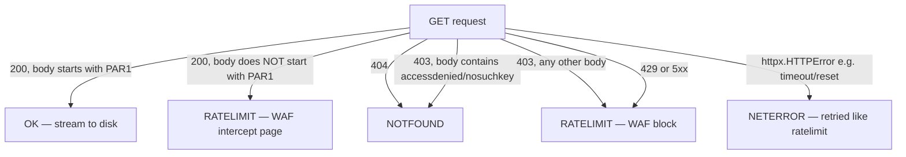

# Downloader

The downloader is `taxi_download`, a Python package that mirrors NYC TLC parquet trip data from CloudFront to a local `raw/` directory. It walks each series chronologically, skips files you already have, validates every download, and knows the difference between a rate-limit block and a file that hasn't been published yet.

It exists because of a specific ambiguity in TLC's CloudFront distribution: HTTP 403 is returned both for files that don't exist yet (with an S3-style `<Code>AccessDenied</Code>` XML body) *and* for requests blocked by AWS WAF, the Web Application Firewall that CloudFront runs in front of the origin. Naive downloaders can't tell them apart, so they either false-positive on rate limiting (backing off unnecessarily on missing files) or false-negative on missing files (hammering a WAF block and extending it). This package classifies the responses correctly and reacts appropriately to each.

When *not* to use it: if you only need ad-hoc analytics and don't want the disk cost, DuckDB's `httpfs` extension querying CloudFront directly is often the right answer — see [Alternatives](#alternatives) below. The downloader is for cases where you want a resumable local mirror: bulk analytics that will re-read the same months many times, offline work, feeding a database via a nightly job, or scheduled catch-up as new months publish.

## Prerequisites

- **Python ≥3.12**
- **[uv](https://docs.astral.sh/uv/)**

Disk sized to your intent — see [Disk sizing](#disk-sizing) below.

## Disk sizing {#disk-sizing}

| Scope                       | Disk needed | Time (residential connection) |
|-----------------------------|-------------|--------------------------------|
| `--recent 3 yellow`         | ≈200 MB     | 1–2 min                       |
| `--recent 3 green`          | ≈15 MB      | seconds                       |
| `--recent 3 fhv`            | ≈120 MB     | 1 min                         |
| `--recent 3 fhvhv`          | ≈1.5 GB     | 5–10 min                      |
| `--recent 3` (all four)     | ≈1.8 GB     | 8–15 min                      |
| Full history yellow only    | ≈30 GB      | 2–4 hours                     |
| Full history green only     | ≈1.2 GB     | 5–10 min                      |
| Full history fhv only       | ≈6 GB       | 30–60 min                     |
| Full history fhvhv only     | ≈37 GB      | 2–4 hours                     |
| **Full history (all four)** | **≈75 GB**  | **6–10 hours**                |

TLC adds roughly 2 GB/month across all types (mostly FHVHV). Plan capacity accordingly if you're building a long-lived mirror.

## Install

```bash
uv sync
```

Run at the repo root. This exposes the `taxi-download` console script (defined in the root `pyproject.toml`).

## Basic usage

```bash
# Full history, all four types (~75 GB, 6–10 hours)
uv run taxi-download

# Full history, one type only
uv run taxi-download yellow

# Recent N months (default 3), all types
uv run taxi-download --recent

# Recent N months (default 3), one type only
uv run taxi-download --recent 3 yellow

# Recent 5 months of one type
uv run taxi-download --recent 5 yellow
```

You can also invoke it as a module, which is equivalent and useful when the console script isn't on `PATH` (e.g., inside another virtualenv):

```bash
python -m taxi_download.cli --recent 3 yellow
```

`data_type` is a positional argument, one of `yellow`, `green`, `fhv`, `fhvhv`; omit it to download all four.

**Arg-ordering gotcha.** `--recent` takes an optional integer (`nargs="?"`, default `3` when given with no value). Because argparse consumes the very next token as that integer, putting the type name directly after a bare `--recent` fails:

```bash
uv run taxi-download --recent yellow   # FAILS: argparse tries int("yellow")
```

Use one of these instead:

```bash
uv run taxi-download --recent 3 yellow   # explicit N, then the type
uv run taxi-download yellow --recent     # type first, --recent defaults to 3
```

The tool is idempotent: files already present under `<data-dir>/raw/` are skipped, and any file that fails PAR1 validation is deleted at the start of the next run and re-downloaded. You can safely `Ctrl-C` mid-run and re-invoke with the same arguments — it will pick up where it left off without duplicating work.

## Windows / WSL {#windows-wsl}

**Native Windows / Git Bash / PowerShell.** Install Python and [uv](https://docs.astral.sh/uv/), then run the commands above exactly as documented. No extra config needed for small pulls.

**WSL2 — the VHDX growth problem.** WSL2 stores your Linux filesystem in a VHDX file on your Windows `C:` drive. Every byte written under the WSL2 root (including `~`, `/home`, `/tmp`, `/opt`) goes into this VHDX file. Full-history TLC data is 100+ GB. The catch: **the VHDX does not shrink when you delete files.** If you download 75 GB into WSL, then `rm -rf` it, your `C:` drive is still 75 GB smaller until you manually compact the VHDX with `wsl --shutdown` + `diskpart`, or `Optimize-VHD` in an elevated PowerShell.

**The fix: point downloads at a Windows path from inside WSL.** Use `--data-dir` to redirect the output root — files land under `<data-dir>/raw`, so anything under `/mnt/c/...` writes directly to the Windows filesystem, bypassing the VHDX entirely:

```bash
uv run taxi-download --recent 3 yellow --data-dir /mnt/c/Users/$USER/taxi-data
```

Deleting files there frees space immediately, and you can point Windows-side tools at the same directory without a WSL round-trip.

## What makes it different

### WAF-aware classifier

Each request is a full streaming `GET` — there's no `Range`-header partial-content probing. The response is classified by status code and, for `403`s, by the response body:



Four outcomes, from `_classify_status` and `fetch_one` in `download.py`:

- **`404`** — `NOTFOUND`.
- **`403` with a body containing `accessdenied` or `nosuchkey`** (case-insensitive) — `NOTFOUND`. The file legitimately isn't published yet. This is the boundary signal the full-history walker uses to stop cleanly at the end of a series.
- **`403` with any other body** — `RATELIMIT`. The WAF has flagged the request. Any other `403` variant (a CloudFront block page, an empty body, anything not matching the AccessDenied/NoSuchKey pattern) is treated as a rate-limit event, not a missing file.
- **`429` or any `5xx`** — `RATELIMIT`.
- **`200` but the downloaded body doesn't validate as PAR1 parquet** — `RATELIMIT`. This is usually a WAF intercept page served with a `200` status; retrying with a fresh connection often succeeds.
- **`httpx.HTTPError`** (connection reset, timeout, DNS failure, etc.) — `NETERROR`, retried exactly like `RATELIMIT`.

### Exponential backoff

`download_month` retries a single month up to `MAX_RETRIES = 4` times on `RATELIMIT`/`NETERROR`, sleeping between attempts with a capped exponential delay: **30s → 90s → 270s**, capped at **3600s** (`BACKOFF_BASE_S=30`, `BACKOFF_FACTOR=3`, `BACKOFF_CAP_S=3600`). If all attempts are exhausted, the month counts as a "give up" for that run and the walker moves on — it does not sleep indefinitely or abort the whole process on a single month.

In full-history mode, a *type* is abandoned early if it accumulates `MAX_CONSECUTIVE_GIVEUPS = 3` consecutive give-ups (per data type, reset by any successful download or `NOTFOUND` skip) — this stops a run from hammering every remaining month for hours against a sustained block. Recent-mode has no consecutive-giveup abort; it simply counts give-ups and reports them.

### Boundary auto-termination

In full-history mode the walker moves chronologically forward from a fixed start month per series:

| Type   | Start month |
|--------|-------------|
| yellow | 2009-01     |
| green  | 2013-08     |
| fhv    | 2015-01     |
| fhvhv  | 2019-02     |

When it hits a `NOTFOUND` response *after* having already downloaded (or found locally) at least one file for that type, it treats that as the end of published data and stops walking that type. A `NOTFOUND` encountered *before* any data has been seen is treated as a pre-series gap and the walker keeps going forward. That's why running `taxi-download` cleanly terminates instead of walking forever into the future.

### PAR1 magic-byte validation

Every downloaded file is verified as valid parquet by checking the `PAR1` magic bytes at **both** head and tail (and requiring at least 8 bytes total). This catches two failure modes at once:

- **Truncated downloads** — dropped connection mid-transfer, missing tail marker.
- **WAF-intercept HTML** that somehow landed at a `.parquet` path — HTML starts with `<`, not `PAR1`.

Downloads stream to a `<name>.parquet.part` temp file first; only after PAR1 validation passes is it atomically moved into place with `os.replace` (via `Path.replace`). Any existing file that fails PAR1 validation is deleted at the start of the next run (`clean_corrupt`), so an interrupted download self-heals without manual cleanup.

## Recent-mode semantics

`download_recent` walker rules, in order:

1. Start at the previous calendar month (`current - 1`). Walk backward one month at a time via `months_backward`.
2. Remote file downloads successfully → increment the "downloaded" counter.
3. Remote returns `NOTFOUND` (`403`+AccessDenied/NoSuchKey, or `404`) → skip, don't count, keep walking backward.
4. Local file already exists at that path → **STOP** walking immediately. This is the incremental catch-up semantic.
5. Loop terminates when the downloaded counter reaches `N`, OR the local-encounter break fires, OR `MAX_LOOKBACK = 18` months have been examined (safety cap for genuinely-empty-series edge cases).

Three worked examples. Assume today is **2026-07-27** and yellow publishes with a ~2 month lag.

**Example 1: Fresh checkout, `--recent 3 yellow`.**

- Tries 2026-06 → `NOTFOUND` (not yet published)
- Tries 2026-05 → downloads
- Tries 2026-04 → downloads
- Tries 2026-03 → downloads

Result: 3 downloaded, examined 4 months.

**Example 2: Same setup a month later, `--recent 3 yellow`.**

- Tries 2026-07 → `NOTFOUND`
- Tries 2026-06 → downloads
- Tries 2026-05 → already local → **STOP**

Result: 1 new file. This is the intended incremental catch-up outcome — you get the new month and nothing else.

**Example 3: Already caught up, `--recent 3 yellow`.**

- Tries 2026-06 → `NOTFOUND`
- Tries 2026-05 → already local → **STOP**

Result: 0 new files, exits cleanly.

If you delete a local file mid-history, subsequent `--recent` runs won't backfill it — they stop at the newer files above. Use `uv run taxi-download yellow` (no `--recent`) to walk the full history from the fixed start month.

## Output layout

```
raw/
  yellow/
    2024/
      yellow_tripdata_2024-01.parquet
      yellow_tripdata_2024-02.parquet
      ...
    2025/
      ...
  green/  fhv/  fhvhv/
```

Sample:

```
$ find raw/ -name '*.parquet' | head
raw/yellow/2024/yellow_tripdata_2024-01.parquet
raw/yellow/2024/yellow_tripdata_2024-02.parquet
raw/yellow/2024/yellow_tripdata_2024-03.parquet
raw/yellow/2024/yellow_tripdata_2024-04.parquet
raw/yellow/2024/yellow_tripdata_2024-05.parquet
raw/yellow/2024/yellow_tripdata_2024-06.parquet
raw/yellow/2024/yellow_tripdata_2024-07.parquet
raw/yellow/2024/yellow_tripdata_2024-08.parquet
raw/yellow/2024/yellow_tripdata_2024-09.parquet
raw/yellow/2024/yellow_tripdata_2024-10.parquet
```

## Configuration

**`--data-dir DIR`** — base directory; files land under `DIR/raw` (default: `.`, i.e. `./raw`). Absolute path, or relative to the current working directory. Use it for WSL (redirect to `/mnt/c/...`), external drives, or NAS mount points:

```bash
uv run taxi-download --recent 3 --data-dir /mnt/nas/tlc-mirror
uv run taxi-download yellow --data-dir /Volumes/BigDisk/taxi
```

**Corporate proxy.** The tool uses `httpx.Client`, which honors standard proxy environment variables (`HTTPS_PROXY`, `NO_PROXY`) via `trust_env` (the default):

```bash
HTTPS_PROXY=http://proxy.corp.internal:3128 uv run taxi-download --recent 3 yellow
```

**Scheduled runs.** A daily cron entry to keep the mirror caught up with minimal disk churn:

```cron
# Run every day at 03:15, log to a rotating file
15 3 * * * cd /srv/taxi && uv run taxi-download --recent 3 >> /var/log/taxi-downloader.log 2>&1
```

Recent-mode's local-encounter break (see [Recent-mode semantics](#recent-mode-semantics)) makes daily runs cheap: once you're caught up, each run tries one or two URLs per type and exits.

## Alternatives

| Tool | When to use it | When NOT to use it |
|---|---|---|
| **This downloader** | Building a resumable local mirror; scheduled catch-up; feeding a database or ETL | You only need one-off queries and don't want the disk cost |
| [`toddwschneider/nyc-taxi-data`](https://github.com/toddwschneider/nyc-taxi-data) | Postgres/ClickHouse importing with SQL loader scripts | You need resumable + WAF-aware retry (it's a one-shot wget loop) |
| DuckDB `httpfs` extension | Ad-hoc analytics, no local mirror needed | Repeated full-scan queries (each query re-downloads); offline work |
| HuggingFace mirrors | Exploratory ML work with the [dataset ports](https://huggingface.co/datasets?search=nyc+taxi) | Production pipelines (snapshots are stale) |

DuckDB `httpfs` in action, no downloader required:

```sql
INSTALL httpfs; LOAD httpfs;
SELECT count(*)
FROM read_parquet('https://d37ci6vzurychx.cloudfront.net/trip-data/yellow_tripdata_2024-01.parquet');
```

## Troubleshooting

**Q: I'm getting rate-limited constantly.**
A: Real progress output looks like `yellow: downloaded X, gave up on Y` per type, then `total downloaded: N` at the end. A large `Y` relative to `X` means most attempts are hitting `RATELIMIT`/`NETERROR` and exhausting the 30s→90s→270s (cap 3600s) retry ladder per month. In full-history mode, once a type accumulates 3 consecutive give-ups it stops early rather than continuing to hammer the WAF. If that happens, the WAF has flagged your IP for longer than the backoff ladder covers; try again in a few hours from a different network or with a VPN.

**Q: The tool says it cleaned corrupt files.**
A: You'll see `cleaned N corrupt parquet file(s)` at the start of a run if any existing `*.parquet` file under `<data-dir>/raw` fails the PAR1 head+tail check — almost always a partial download from a previously interrupted run (before atomic replace could complete, or from an older run). Those files are deleted before the run starts, and the run will re-download them.

**Q: What's the exit code mean?**
A: `main()` returns `0` unless a type finished with `downloaded == 0` and `gaveup > 0` — i.e., that type made zero progress and hit at least one exhausted retry — in which case the overall exit code is `2`. A type that downloaded at least one file, or gave up on zero months, does not trigger the non-zero exit even if some months were skipped as give-ups.

**Q: I want to point downloads at S3 instead of local disk.**
A: Not supported today. The tool writes to a local path (streamed to `<name>.parquet.part`, then atomically moved into place). You could `rclone sync` the local mirror to S3 after each run. PR welcome to add native cloud support.

**Q: Full history took longer than the estimate.**
A: Residential broadband varies; TLC has occasional slow days; FHVHV files are the largest (avg ~420 MB each vs yellow's ~147 MB). Check ETA against your actual link speed, not the sizing table's mid-range estimates.

**Q: Can I run multiple types in parallel to speed things up?**
A: Not recommended. The WAF rate-limits per source IP, so parallel invocations tend to trip the backoff ladder on both jobs and end up slower than a sequential run (each `taxi-download` invocation already downloads all requested types sequentially within one process). If you really need to parallelize, run separate invocations from separate egress IPs (e.g., different cloud regions).

**Q: How do I mirror to a machine without internet, using a jump host?**
A: Run the downloader on the jump host with `--data-dir` pointing at a shared path, then `rsync -a` the `raw/` tree to the destination. The layout is stable, so incremental `rsync` runs are cheap.
