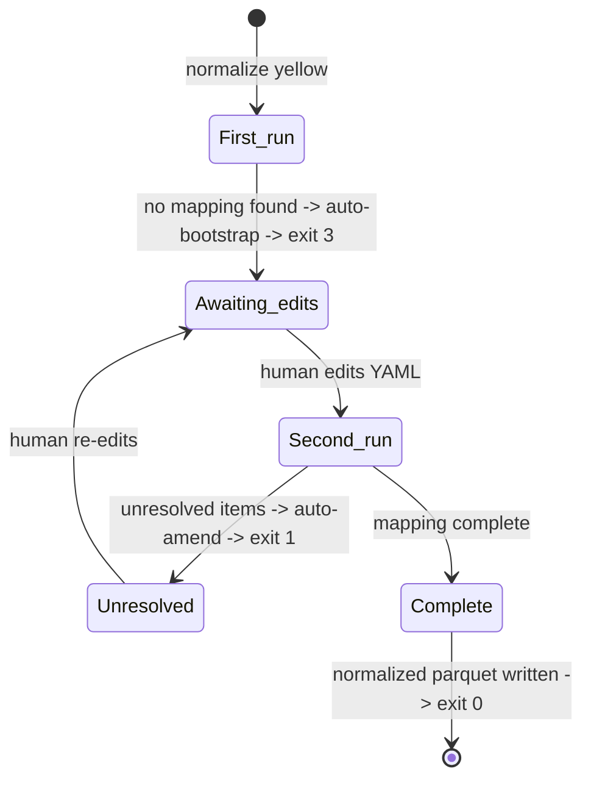

# Normalize

**Data loss is a first-class error, not a warning.** The `normalize` tool rewrites historical TLC parquet to conform to the latest schema — but every silent drop of non-null data, every lossy cast, requires an explicit human acknowledgment written into a version-controlled mapping YAML. There is no `--force` flag. There is no "warn and continue" mode. If the tool can't prove a transformation is loss-free, it halts and asks.

The operational model is a two-phase loop: you run the tool, and it either (a) writes normalized parquet successfully or (b) rewrites a per-type mapping file with new items for you to review. You edit the mapping, re-run, and repeat until everything is resolved. On the first run against a raw type that has no mapping yet, the tool auto-generates the scaffold from the actual raw data and exits without writing any parquet. On every subsequent run it validates the mapping against the current raw data and, if new schema drift has appeared since the last run, amends the mapping in place with new SUGGESTED/TODO entries.

This bootstrap-and-amend semantics is what makes `normalize` safe to run on a schedule. A future orchestrator sub-project will invoke `normalize` on a cron — when TLC ships new drift (they do, roughly once a year), you'll wake up to a mapping-file diff to review in a pull request, not a silent failure and not a wholesale scaffold regeneration that clobbers your prior decisions.

## Prerequisites

- A `raw/<type>/` mirror produced by the [downloader](downloader.md).
- `uv sync` in the repo root.

## Install

```bash
uv sync
```

That's it. `normalize` is exposed as a `uv run` entry point.

## The three-state model

Every invocation of `normalize <type>` resolves to exactly one of three outcomes: **bootstrap** (no mapping yet), **amend** (mapping exists but has unresolved items), or **normalize** (mapping is complete).



**First run.** No mapping file exists at `normalize/mappings/<type>.yaml`. The tool scans the raw parquet metadata, invokes schema-drift's rename detector, and writes a mapping YAML with a machine-generated timeline header and a SUGGESTED/TODO scaffold covering every rename candidate, lossy cast, and unmapped column with data. Then it prints next-step instructions and exits 3. No parquet is written.

**Awaiting edits.** The tool has done all it can. Your turn: open the YAML, uncomment the SUGGESTED renames you agree with (delete the ones you don't), and fill in `ack_date:` on the TODO blocks for lossy casts and data drops you want to accept. This is the pause-and-think step. It's not automatable, and it's not supposed to be.

**Second run with unresolved items.** You re-run `normalize <type>`. The tool loads the mapping, plans the transformation for every historical file, and finds items still unresolved — either because you didn't finish editing, or because new drift has appeared (TLC added a column, changed a type). The tool amends the mapping in place: existing entries are preserved, new SUGGESTED/TODO items are appended below. It prints a consolidated error report and exits 1. Still no parquet written.

**Second run with complete mapping.** Every historical file is fully planned. The tool writes normalized parquet to `raw-normalized/<type>/<year>/*.parquet`, mirroring the input layout. Files already present in the output directory are skipped, so the second-time cost is only the incremental diff. Exit 0.

## Mapping file

The mapping YAML lives at `normalize/mappings/<type>.yaml` and is version-controlled alongside the rest of the repo. Every non-comment change to this file is an operational decision worth reviewing in a PR.

```yaml
# Generated by `normalize yellow` on 2026-07-22.
# Detected drift transitions:
#   2013-01 -> 2015-01: renamed pu_datetime->tpep_pickup_datetime; added PULocationID
#   2016-06 -> 2016-07: dropped pickup_latitude, pickup_longitude
#   2020-01 -> 2020-02: added congestion_surcharge
#   2023-01 -> 2023-02: added airport_fee

target: yellow_tripdata_2024-01.parquet

renames:
  pu_datetime: tpep_pickup_datetime
  do_datetime: tpep_dropoff_datetime

lossy_casts:
  passenger_count:
    from: DOUBLE
    to: BIGINT
    ack_date: 2026-07-21

acknowledged_data_loss:
  pickup_latitude:
    ack_date: 2026-07-21
  pickup_longitude:
    ack_date: 2026-07-21
```

See the [Reference → Configuration](../reference/configuration.md) page for the field-by-field schema.

## Bootstrap and amend

Both operations run the same underlying analysis; the difference is in whether existing content is preserved.

### Bootstrap

Fires when no mapping file exists. Sequence:

1. Scan `raw/<type>/**/*.parquet` via parquet metadata only — no data scan.
2. Call `schema_drift.analyze.analyze_data_type()` in generic mode to compute the drift timeline plus rename candidates.
3. Emit YAML with:
   - **Timeline header** — one comment line per detected transition, listing renames/adds/drops/type-changes between adjacent schema signatures.
   - **`target:`** — pinned to the newest raw file. This is the canonical schema all historical files will be rewritten to.
   - **`renames:`** — commented `# SUGGESTED (confidence X%, data-verified) - uncomment to accept:` lines above each rename candidate detected by schema-drift. The label reads `data-verified` when confidence is ≥80%, otherwise `NOT data-verified - review carefully`.
   - **`lossy_casts:`** — commented TODO blocks for every type change that could lose data.
   - **`acknowledged_data_loss:`** — commented TODO blocks for every column that has historical data but no place to land in the target schema.
4. Exit 3 with next-step instructions.

### Amend

Fires when the mapping exists but the planner finds unresolved items. Sequence:

1. Load the existing mapping — the loader parses YAML semantically, so `renames:` dict entries and `ack_date` values survive. **Body comments do not survive**; PyYAML strips them on parse.
2. Recompute the drift analysis from the current raw files.
3. Diff the new analysis against the existing mapping's semantic content — determine which items are NOT already handled.
4. Rewrite the file: regenerated timeline header, then existing entries (renames, lossy_casts, acknowledged_data_loss), then newly appended SUGGESTED/TODO items per section.
5. Print the consolidated unresolved report + amendment note. Exit 1.

The critical property: **your semantic decisions survive**. A rename you accepted stays accepted. An `ack_date` you filled in stays filled in. What you lose are the free-form comments you wrote in the file body — because there's no way for the tool to associate a comment with the entry it describes across an edit. Put reasoning in the `reason:` field of an ack entry instead, or in the git commit message.

Operational rationale: the (future) orchestrator sub-project will run `normalize` on a cron. When TLC ships new drift, amend semantics mean the human wakes up to a mapping-file diff to review — not a silent failure, not a scaffold regenerated from scratch.

## The `ack_date` convention

`ack_date` is the only required field for `lossy_casts:` and `acknowledged_data_loss:` entries. `ack_by` and `reason` are optional but recommended.

**Minimum ack:**

```yaml
lossy_casts:
  passenger_count:
    from: DOUBLE
    to: BIGINT
    ack_date: 2026-07-21
```

**Well-documented ack** (recommended for public or audit-friendly repos):

```yaml
lossy_casts:
  passenger_count:
    from: DOUBLE
    to: BIGINT
    ack_date: 2026-07-21
    ack_by: andrekamman
    reason: "Values are logically integer; the 2011-2014 DOUBLE was a data-entry choice."
```

Why the convention: the `ack_date` is the enforced pause-and-think. Its presence is what the tool checks; its value is what a future reviewer reads. `ack_by` and `reason` add context that git history alone can approximate — you can always `git blame` the file — but only if the author's identity is clear at the time of the edit. Recording it in the YAML makes the decision self-contained.

## Exit codes

| Code | Meaning | What to do |
|---|---|---|
| 0 | Success — files normalized or already present; or no `raw/<type>` directory found for this type (skipped, nothing to do) | Nothing, or mirror the raw data first if that was unexpected |
| 1 | Mapping incomplete; unresolved items reported and mapping amended | Edit the mapping YAML, re-run |
| 2 | Configuration error (mapping failed to load, target file not found, or bootstrap/amend analysis error) | Fix the reported issue |
| 3 | First run; scaffold generated | Review the scaffold, edit, re-run |

A missing `raw/<type>` directory is **not** a configuration error — it's treated as "nothing to normalize yet" and prints `<type>: no raw files at <raw_dir>, skipping`, exiting 0 for that type.

When you invoke `normalize` with no argument, the tool runs all four types in turn and returns the highest exit code observed. This means a mixed run — say, `yellow` succeeds and `fhvhv` needs edits — exits 1, and CI can treat it as needs-attention.

## The `--sample` flag

`--sample <N|N%>` controls the number of rows sampled during rename-detection verification during bootstrap and amend. Default `100%` (full scan — err on the safe side).

Reduce it only for very large datasets where bootstrap runtime becomes a problem:

```bash
uv run normalize yellow --sample 10%
uv run normalize yellow --sample 5000
```

Important caveat: metadata-only checks (schema comparisons, null counts, min/max ranges) and precision scans (DOUBLE -> BIGINT truncation detection) **always full-scan** regardless of `--sample`. Sampling those risks a false-negative data-loss decision, which is exactly the failure mode the tool exists to prevent.

## The `--data-dir` flag

`--data-dir <dir>` controls where data is read from and written to. It reads raw parquet from `<data-dir>/raw/<type>` and writes normalized parquet to `<data-dir>/raw-normalized/<type>`. Default is `.` (the current directory).

```bash
uv run normalize yellow --data-dir /path/to/data
```

Note: the mapping file path is **not** affected by `--data-dir`. It's always resolved as `normalize/mappings/<type>.yaml` relative to the current working directory, regardless of where `--data-dir` points the raw/normalized data.

## Worked example 1: First-time yellow

Assume you've mirrored the full yellow-taxi history to `raw/yellow/` via the downloader. Run:

```bash
uv run normalize yellow
```

Expected output:

```text
yellow: no mapping found — analyzed raw data and wrote normalize/mappings/yellow.yaml.
  Detected 4 drift transition(s) — see file header.
  6 SUGGESTED/TODO item(s) need your review.

Next steps:
  1. Review normalize/mappings/yellow.yaml
  2. Uncomment SUGGESTED entries you accept, delete the rest
  3. Fill in `ack_date:` for each TODO to acknowledge lossy casts or data loss
  4. Re-run: uv run normalize yellow
```

The generated `normalize/mappings/yellow.yaml` looks roughly like this:

```yaml
# Generated by `normalize yellow` on 2026-07-22.
# Review each SUGGESTED entry: uncomment to accept, delete to reject.
# Fill in `ack_date:` for each TODO to acknowledge lossy casts or data loss.
# Detected drift transitions:
#   2013-01 -> 2015-01: renamed pu_datetime->tpep_pickup_datetime; added PULocationID
#   2016-06 -> 2016-07: dropped pickup_latitude, pickup_longitude
#   2020-01 -> 2020-02: added congestion_surcharge
#   2023-01 -> 2023-02: added airport_fee

target: yellow_tripdata_2024-01.parquet

renames:
  # SUGGESTED (confidence 94%, data-verified) - uncomment to accept:
  # pu_datetime: tpep_pickup_datetime
  # SUGGESTED (confidence 94%, data-verified) - uncomment to accept:
  # do_datetime: tpep_dropoff_datetime

lossy_casts:
  # DETECTED: passenger_count changed DOUBLE -> BIGINT. max value 12345678901234567890.0 exceeds BIGINT range (max 9223372036854775807)
  # Set ack_date to accept (ack_by and reason are optional):
  # passenger_count:
  #   from: DOUBLE
  #   to: BIGINT
  #   ack_date: TODO

acknowledged_data_loss:
  # DETECTED: pickup_latitude has non-null data in 187 file(s),
  # no rename candidate above the confidence threshold.
  # Set ack_date to accept the loss (ack_by and reason are optional):
  # pickup_latitude:
  #   ack_date: TODO
  # DETECTED: pickup_longitude has non-null data in 187 file(s),
  # no rename candidate above the confidence threshold.
  # Set ack_date to accept the loss (ack_by and reason are optional):
  # pickup_longitude:
  #   ack_date: TODO
```

You review and edit — accepting the SUGGESTED renames, acking the drops:

```diff
 renames:
-  # SUGGESTED (confidence 94%, data-verified) - uncomment to accept:
-  # pu_datetime: tpep_pickup_datetime
-  # SUGGESTED (confidence 94%, data-verified) - uncomment to accept:
-  # do_datetime: tpep_dropoff_datetime
+  pu_datetime: tpep_pickup_datetime
+  do_datetime: tpep_dropoff_datetime

 lossy_casts:
-  # DETECTED: passenger_count changed DOUBLE -> BIGINT. max value 12345678901234567890.0 exceeds BIGINT range (max 9223372036854775807)
-  # Set ack_date to accept (ack_by and reason are optional):
-  # passenger_count:
-  #   from: DOUBLE
-  #   to: BIGINT
-  #   ack_date: TODO
+  passenger_count:
+    from: DOUBLE
+    to: BIGINT
+    ack_date: 2026-07-22

 acknowledged_data_loss:
-  # DETECTED: pickup_latitude has non-null data in 187 file(s),
-  # no rename candidate above the confidence threshold.
-  # Set ack_date to accept the loss (ack_by and reason are optional):
-  # pickup_latitude:
-  #   ack_date: TODO
-  # DETECTED: pickup_longitude has non-null data in 187 file(s),
-  # no rename candidate above the confidence threshold.
-  # Set ack_date to accept the loss (ack_by and reason are optional):
-  # pickup_longitude:
-  #   ack_date: TODO
+  pickup_latitude:
+    ack_date: 2026-07-22
+  pickup_longitude:
+    ack_date: 2026-07-22
```

Second run:

```bash
uv run normalize yellow
```

Expected output:

```text
yellow: 209 file(s) normalized, 0 skipped (already present).
```

Verify:

```bash
find raw-normalized/yellow -name '*.parquet' | wc -l
```

Expected: `209` (matching the raw count).

Every historical file is now rewritten in the target file's schema. Downstream queries can assume a single schema across the entire history — no per-year branching, no runtime column-existence checks.

## Worked example 2: New drift appears months later

Fast-forward to 2028. TLC has changed the format again — added a new column (`route_zone_hash`) and narrowed the type of `passenger_count` from `DOUBLE` to `INTEGER`. Your existing `normalize/mappings/yellow.yaml` from 2026 no longer covers everything. You re-run:

```bash
uv run normalize yellow
```

Expected output:

```text
ERROR: yellow - 2 unresolved item(s) in normalize/mappings/yellow.yaml
  Cannot normalize this data type until these are handled.

  - passenger_count: unacked_lossy_cast: DOUBLE -> INTEGER would lose data (range/precision)
  - route_zone_hash: unmapped_drop: column has data; add to renames: or acknowledged_data_loss:

  I've amended normalize/mappings/yellow.yaml with 2 new SUGGESTED/TODO item(s) for the unresolved columns.
  Review the additions, then edit the mapping and re-run.

  Nothing was written for yellow.
```

The amended mapping now looks like:

```yaml
# Amended by `normalize yellow` on 2028-03-14.
# Existing entries preserved; new SUGGESTED/TODO items appended.
# Review each new SUGGESTED entry: uncomment to accept, delete to reject.
# Detected drift transitions:
#   2013-01 -> 2015-01: renamed pu_datetime->tpep_pickup_datetime; added PULocationID
#   2016-06 -> 2016-07: dropped pickup_latitude, pickup_longitude
#   2020-01 -> 2020-02: added congestion_surcharge
#   2023-01 -> 2023-02: added airport_fee
#   2027-11 -> 2027-12: added route_zone_hash; type-changed passenger_count(DOUBLE->INTEGER)

target: yellow_tripdata_2028-02.parquet

renames:
  pu_datetime: tpep_pickup_datetime
  do_datetime: tpep_dropoff_datetime

lossy_casts:
  passenger_count:
    from: DOUBLE
    to: BIGINT
    ack_date: 2026-07-22
  # DETECTED: passenger_count changed DOUBLE -> INTEGER. max value 4000000000.0 exceeds INTEGER range (max 2147483647)
  # Set ack_date to accept (ack_by and reason are optional):
  # passenger_count:
  #   from: DOUBLE
  #   to: INTEGER
  #   ack_date: TODO

acknowledged_data_loss:
  pickup_latitude:
    ack_date: 2026-07-22
  pickup_longitude:
    ack_date: 2026-07-22
  # DETECTED: route_zone_hash has non-null data in 5 file(s),
  # no rename candidate above the confidence threshold.
  # Set ack_date to accept the loss (ack_by and reason are optional):
  # route_zone_hash:
  #   ack_date: TODO
```

Notice the existing entries are all preserved. Now you decide:

- `route_zone_hash` — is this a *rename* of an older column you'd been dropping, or a genuinely new column with no historical equivalent? If a rename, add it to `renames:`; if you want to drop it, ack it under `acknowledged_data_loss:`.
- `passenger_count` — the target type has narrowed from `BIGINT` (2026) to `INTEGER` (2028). Update the existing lossy-cast entry's `to:` field to `INTEGER` and bump the `ack_date`.

Edit accordingly and re-run:

```bash
uv run normalize yellow
```

Exit 0, normalized parquet reflects the new target schema, and every historical file is once again queryable under a single schema.

## What runs automatically (no mapping needed)

Some transformations are provably loss-free and never require an ack.

- **All-null column drops.** A historical column that is null in every row across every file, and is missing from the target schema, is dropped automatically. No mapping entry needed. Rationale: no data is being lost.
- **Missing-in-historical null-fill.** A column that appears in the target but not in a given historical file is filled with `NULL` in the normalized output. No mapping needed. This is the common case for columns TLC added over time (`congestion_surcharge`, `airport_fee`).
- **Safe widening casts.** `INT` -> `BIGINT`, `FLOAT` -> `DOUBLE`, `VARCHAR(10)` -> `VARCHAR(50)`, and equivalents. Automatic, no mapping needed. Rationale: the target type can represent every possible source value, so the transformation cannot lose information.

## What triggers an error

- **Non-null column without mapping.** A column with any non-null historical value that is missing from the target schema AND does not appear in `renames:` or `acknowledged_data_loss:`. The tool amends the mapping with a SUGGESTED rename (if schema-drift found a plausible candidate) or a TODO ack block.
- **Lossy cast without ack.** A type change where the target type cannot represent every source value: `DOUBLE` -> `BIGINT` with fractional values in the source, `VARCHAR(50)` -> `VARCHAR(10)` with strings longer than 10 chars, range narrowing that would overflow. The tool amends the mapping with a TODO `lossy_casts:` block.

In both cases: nothing is written to `raw-normalized/`. The tool exits 1. Your job is to review the amendment, decide the right handling, and re-run.
